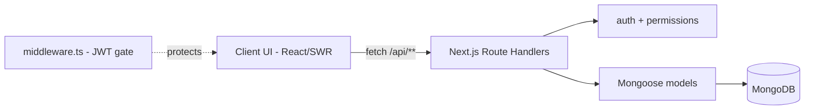

# 07 System Architecture

> This is the product-level architecture summary. The canonical deep dive is
> [`ARCHITECTURE.md`](ARCHITECTURE.md). Keep them consistent.

## Diagram

## Layers
- **Client:** client components (board/backlog/list/calendar/timeline/dashboard/reports)
  fetch with SWR and mutate via `api()`. Optimistic updates for drag & drop.
- **Middleware:** `src/middleware.ts` verifies the `sm_session` JWT and redirects
  unauthenticated users to `/login` (and authenticated users away from auth pages).
- **API / handlers:** `src/app/api/**` — auth → permission → zod validation → Mongoose →
  activity/notifications → JSON response.
- **Data:** single MongoDB accessed through cached Mongoose connection; models in
  `src/models/index.ts`. See [`current-infrastructure/mongodb.md`](current-infrastructure/mongodb.md).

## Data Flow
A board drag (task → new column):
1. UI optimistically updates the SWR cache and calls `POST /api/tasks/reorder`.
2. If the status changed, it also calls `PATCH /api/tasks/[id]` (for timestamps + watcher notifications).
3. Each handler runs `withAuth()`, checks `can(user, projectId, "task:edit")`, updates the
   `Task`, writes an `Activity` entry, and notifies watchers.
4. SWR revalidates; the board reflects the persisted order/status.
